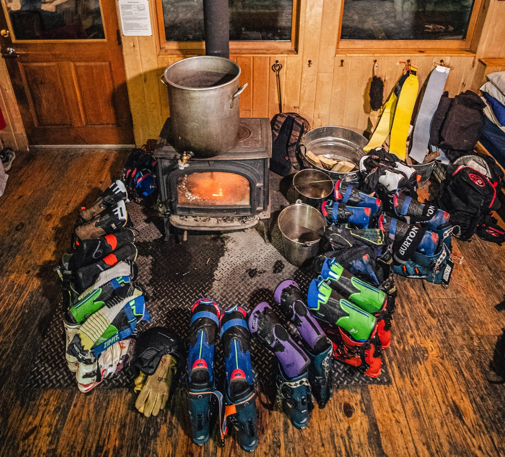

# Fit Quiz V1 — Image Assets

All image files referenced by the quiz live in the `assets/` folder. Make sure these files exist with these exact filenames (case-sensitive):

## Required asset files

| File | Used for |
|------|----------|
| `assets/logo-black.png` | ZipFit header logo |
| `assets/lifestyle-liner.jpg` | Intro card lifestyle photo |
| `assets/liner-corsa.png` | Corsa liner result image |
| `assets/liner-gft.png` | GFT liner result image |
| `assets/liner-espresso.png` | Espresso liner result image |
| `assets/liner-gara-lv.png` | Gara Low-Volume liner result image |
| `assets/liner-gara-hv.png` | Gara High-Volume liner result image |
| `assets/liner-freeride.png` | Freeride liner result image |
| `assets/liner-workhorse.png` | Workhorse liner result image |

## Folder structure

```
your-repo/
├── Fit Quiz V1.html
├── variant1.jsx
├── shared.jsx
├── data.js
└── assets/
    ├── logo-black.png
    ├── lifestyle-liner.jpg
    ├── liner-corsa.png
    ├── liner-gft.png
    ├── liner-espresso.png
    ├── liner-gara-lv.png
    ├── liner-gara-hv.png
    ├── liner-freeride.png
    └── liner-workhorse.png
```

## Image code in `variant1.jsx`

```jsx
{/* Header logo */}


{/* Intro lifestyle photo */}


{/* Result liner image (dynamic) */}

```

## Image lookup in `data.js`

```js
window.LINER_IMG = {
  corsa:     'assets/liner-corsa.png',
  gft:       'assets/liner-gft.png',
  espresso:  'assets/liner-espresso.png',
  gara_lv:   'assets/liner-gara-lv.png',
  gara_hv:   'assets/liner-gara-hv.png',
  freeride:  'assets/liner-freeride.png',
  workhorse: 'assets/liner-workhorse.png',
};
```

## .gitignore note

Make sure your `.gitignore` does **not** exclude the `assets/` folder or image files:

```gitignore
!assets/
!assets/*.png
!assets/*.jpg
```
